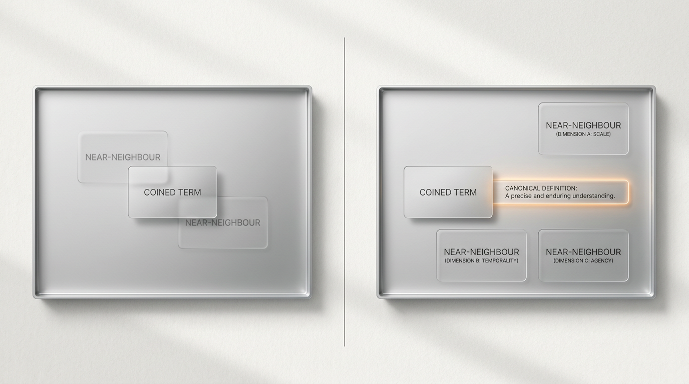

# The Limits of My Tokens: The Token-Substrate Hypothesis and the Coinage Probe



> For LLMs, the externally writable in-context token sequence IS the cognitive substrate for category-use — the only handle that is movable from outside the weights. A position paper paired with a pre-specified multi-model probe study (3 frontier models × 10 low-attestation coined targets plus 2 positive controls; 36 model×term cells, 108 trials, 324 paired distinguishability measurements; panel-vs-author Cohen's κ = +0.71) testing whether introducing a one-sentence definition widens the model's vocabulary boundary.

**Author:** Alexandru Mares — [allemaar.com](https://allemaar.com)
**ORCID:** [0009-0009-6713-9780](https://orcid.org/0009-0009-6713-9780)
**Version:** 0.4.1
**Status:** Release candidate v0.4.1 — Zenodo deposit pending. Will publish as v1.0.0 once DOI is minted.
**License:** [CC-BY-4.0](LICENSE)

[](https://doi.org/{{DOI}})
[](https://arxiv.org/abs/{{ARXIV_ID}})

---

## Abstract

We argue that for a large language model (LLM) the **externally writable** in-context token sequence **IS** the cognitive substrate for category-use — not a representation OF cognition that runs on some deeper substrate, but the substrate itself, the only handle that is movable from outside the weights. We call this position the **Token-Substrate Hypothesis** (TSH). The strong form of Sapir–Whorf was rejected for humans because humans have prelinguistic cognition, the *Off-Token Route*; LLMs do not, and for them Wittgenstein's *Tractatus* 5.6 stops being metaphor and becomes architecture. We test TSH with a methodology we call the **Coinage Probe**: a paired-trial elicitation that scores an LLM's distinguishability on a coined term against named near-neighbors before and after introducing a one-sentence canonical definition. Across **3 cross-vendor frontier models** (Claude Opus 4.7, GPT-5.5, Gemini 2.5 Pro) and **10 low-attestation coined targets plus 2 positive controls**, we ran 108 trials × 3 near-neighbors per trial = **324 paired distinguishability measurements** across 36 model×term cells, scored by a three-judge panel and compared against an author-rated 22-trial audit sample (panel-vs-author Cohen's κ = +0.71). Mean cell-level Lexical Reachability (post minus cold) was **+5.47** on a 9-point scale (95% CI: +5.13, +5.80; cell-level Cohen's *d_cell* = +3.95 across n = 30 novel model×term cells). The effect replicated across the panel (cross-model CV = 0.109) with a model-style interaction qualifying strict invariance, did not persist into a re-cold chat (H3 supported), and was absent on positive controls (H4 supported). **These results support a bounded version of the Token-Substrate Hypothesis: in-context vocabulary functions as an externally writable substrate for LLM category use. For deployed LLM systems, notation is therefore not mere packaging; it is a design surface that shapes what distinctions the system can reliably use.**

---

## Read

- **Paper (PDF):** [`paper.pdf`](paper.pdf) *(rendered at v1.0.0 release)*
- **Paper (Markdown source):** [`paper.md`](paper.md)
- **Figures:** [`figures/`](figures/) — Three infographic plates (`fig1-infographic-wittgenstein-flip.png`, `fig2-infographic-coinage-probe-shape.png`, `fig3-infographic-boundary-shift.png`) and three analysis figures (`fig4-lr-strip.png`, `fig5-model-boxplots.png`, `fig6-stratum-boxplots.png`).
- **Changelog:** [`changelog.md`](changelog.md)

---

## Cite

```bibtex
@misc{mares2026tsh,
  author       = {Mares, Alexandru},
  title        = {The Limits of My Tokens: The Token-Substrate Hypothesis and the Coinage Probe},
  year         = {2026},
  publisher    = {Zenodo},
  version      = {0.4.0},
  doi          = {{{DOI}}},
  url          = {https://doi.org/{{DOI}}}
}
```

GitHub also renders a "Cite this repository" button from [`CITATION.cff`](CITATION.cff).

---

## Reproduce

This is a position-and-empirical paper. The Coinage Probe protocol is fully specified in the paper body (§3) and a separate pre-specification document (Appendix C). Per-trial verbatim transcripts and the panel-and-human-rater scores are deposited with the Zenodo release. Independent reproduction requires API access to the three frontier models listed (Claude Opus 4.7, GPT-5.5, Gemini 2.5 Pro) and adherence to the pre-specified judging rubric and seed (`0x4D29_8B1F_6E07_C3A2`).

---

## Companion paper

This paper is paired with [**Elastic Automators: A Diagnostic Vocabulary for Language-Model-Driven Workflow Systems**](https://doi.org/10.5281/zenodo.19802018) (Mares 2026; Zenodo DOI 10.5281/zenodo.19802018). EA names what these systems do; TSH names what their cognition runs on. The follow-up *Token-Bound Automation* paper bridges the two via the claim that every elastic automator is architecturally a token-bound automator.

---

## More from this author

See [allemaar/papers](https://github.com/allemaar/papers) for the full research program across TK, YON, TSH, SEN, EA, and SAI domains.

---

## License

The paper text and figures are released under [CC-BY-4.0](LICENSE). Any code in subdirectories is released under MIT unless stated otherwise.
